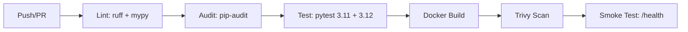

# Ask IRA — CI/CD & Deployment Guide

## Overview

This project uses **GitHub Actions** for CI/CD with four workflows that run automatically on push/PR to `main` and `develop` branches.

| Workflow | File | Trigger | What It Does |
|----------|------|---------|-------------|
| **CI** | `.github/workflows/ci.yml` | Push to `main`/`develop`, PR to `main` | Lint → Audit → Test (3.11 + 3.12) → Docker build → Trivy scan → Smoke test |
| **Deploy** | `.github/workflows/deploy.yml` | Push to `main`, workflow_dispatch | Deploy to Railway, GHCR, Kubernetes, Vercel, Render |
| **Security** | `.github/workflows/security.yml` | Push to `main`/`develop`, weekly Mon 06:00 | CodeQL, Trivy FS scan, pip-audit, Gitleaks secrets detection |
| **PR Checks** | `.github/workflows/pr-checks.yml` | PR open/edit/sync | Size label, conventional commit title check, label validation |

---

## CI Pipeline (`.github/workflows/ci.yml`)



### Required Secrets for CI

| Secret | Where to Get |
|--------|-------------|
| `OPENAI_API_KEY` | [platform.openai.com/api-keys](https://platform.openai.com/api-keys) |

### Steps

1. Push triggers the workflow
2. **Lint**: `ruff check` + `mypy` (optional)
3. **Audit**: `pip-audit` for known CVEs (non-blocking)
4. **Test**: `pytest` with coverage on Python 3.11 + 3.12
5. **Docker build**: multi-stage build from `deployment/Dockerfile`
6. **Trivy scan**: vulnerability scan on built image
7. **Smoke test**: run container, hit `/health` endpoint

---

## Deploy Pipeline (`.github/workflows/deploy.yml`)

### Automatic Deploy Targets (push to `main`)

| Target | Platform | Free Tier | Notes |
|--------|----------|-----------|-------|
| Railway | `railway.app` | $5/mo credit, 512MB RAM | Primary API host |
| GHCR | `ghcr.io` | Unlimited public images | Container registry |
| Kubernetes | Any K8s cluster | K3s/Minikube/Cloud trial | `deployment/kubernetes/*.yaml` |
| Vercel | `vercel.com` | Free tier | REST API proxy to Railway |
| Render | `render.com` | 512MB, 750h/mo | Triggered via deploy hook |

### Manual Deploy via `workflow_dispatch`

```bash
# Target specific platform
gh workflow run Deploy --ref main -f environment=railway
# Deploy to all platforms
gh workflow run Deploy --ref main -f environment=all
```

### Required Secrets for Deploy

| Secret | Use | Where to Get |
|--------|-----|-------------|
| `RAILWAY_TOKEN` | Deploy to Railway | Railway dashboard → Tokens |
| `VERCEL_TOKEN` | Deploy to Vercel | Vercel dashboard → Settings → Tokens |
| `RENDER_DEPLOY_HOOK_URL` | Trigger Render deploy | Render dashboard → Deploy Hooks |
| `KUBECONFIG` | Deploy to Kubernetes | K8s cluster kubeconfig (base64) |
| `OPENAI_API_KEY` | Runtime LLM calls | OpenAI platform |
| `GITHUB_TOKEN` | GHCR login | Auto-provided by GitHub |

### Deploy Architecture

```
User Browser
    │
    ├── Vercel (CDN) ── static frontend from src/static/
    │       │
    │       └── Proxy /api/* ──→ Railway (FastAPI backend)
    │
    ├── Railway ── Docker container (uvicorn, 2 workers)
    │       │
    │       ├── PostgreSQL 16 (managed)
    │       └── Redis 7 (managed)
    │
    ├── GHCR ── Container images (amd64 + arm64)
    │
    └── K8s ── Deployment (2 replicas, HPA)
```

---

## Build Steps

### Local Docker Build

```bash
# Build
docker build -f deployment/Dockerfile -t ask-ira:latest .

# Run
docker run -p 8000:8000 --env-file .env ask-ira:latest

# Verify
curl http://localhost:8000/health
```

### Docker Compose (full stack)

```bash
# Start API + PostgreSQL + Redis
docker compose -f deployment/docker-compose.yml up -d

# Seed data
docker compose -f deployment/docker-compose.yml --profile seed run seed

# Monitoring stack
docker compose -f deployment/docker-compose.yml -f deployment/docker-compose.monitoring.yml up -d
```

### Local Dev (no Docker)

```bash
pip install -e ".[all]"
python -m src.main
# → http://localhost:8000
```

---

## Security Pipeline (`.github/workflows/security.yml`)

Runs weekly (Mon 06:00 UTC) and on every push:

| Scan | Tool | Scope |
|------|------|-------|
| CodeQL | GitHub CodeQL | Python security + quality queries |
| Filesystem | Trivy | Repo filesystem (HIGH/CRITICAL) |
| Dependencies | pip-audit | Python package CVEs |
| Secrets | Gitleaks | Hardcoded credentials |

---

## PR Checks (`.github/workflows/pr-checks.yml`)

On every PR open/edit:

| Check | Rule |
|-------|------|
| Size label | Auto-labels: XS (≤2), S (≤20), M (≤100), L (≤500), XL (≤1000), XXL (>1000) |
| Title format | Must match `feat|fix|docs|style|refactor|perf|test|chore|ci|build|revert(scope): description` |
| Labels | Warning if no labels applied |

---

## Quick Reference

```bash
# Push to main (triggers CI + Deploy)
git push origin main

# Push to develop (triggers CI + Security)
git push origin develop

# Create a PR (triggers CI + PR Checks)
gh pr create --title "feat: my feature" --body "description"

# Skip CI (add to commit message)
git commit -m "docs: update readme [skip ci]"
```

## Required GitHub Secrets Setup

Go to **GitHub repo → Settings → Secrets and variables → Actions** and add:

| Secret | Required For | Status |
|--------|-------------|--------|
| `OPENAI_API_KEY` | CI tests, Runtime | **Required** |
| `RAILWAY_TOKEN` | Railway deploy | Optional |
| `VERCEL_TOKEN` | Vercel deploy | Optional |
| `RENDER_DEPLOY_HOOK_URL` | Render deploy | Optional |
| `KUBECONFIG` | K8s deploy | Optional |

---

## Monitoring

- **Health**: `GET /health` (used by Docker/K8s probes)
- **Metrics**: `GET /metrics` (Prometheus format, port 8000)
- **Grafana**: `deployment/docker-compose.monitoring.yml` (includes Prometheus + Grafana)
- **Logs**: Structured JSON via `src/config/logging.py`
