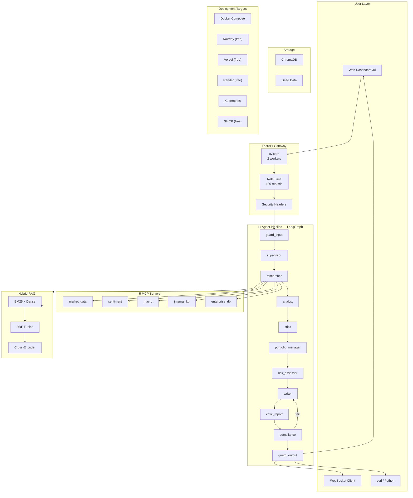

# Ask IRA — Multi-Agent Investment Research System

[](https://github.com/your-org/ask-ira/actions/workflows/ci.yml)
[](https://python.org)
[](https://opensource.org/licenses/MIT)

**Ask IRA** is a production-grade investment research system powered by **LangGraph multi-agent orchestration**, **5 MCP servers** for dynamic data discovery, a **hybrid RAG pipeline**, and **6-layer security guardrails** — all accessible via REST API, WebSocket streaming, and an interactive web dashboard.

---

## Table of Contents

- [What This Project Does](#what-this-project-does)
- [Architecture](#architecture)
- [Free Tools & Sign-Up Guide](#free-tools--sign-up-guide)
- [Prerequisites](#prerequisites)
- [Quick Start (Local)](#quick-start-local)
- [Build (Docker)](#build-docker)
- [Deploy](#deploy)
  - [Option 1: Docker Compose (Local)](#option-1-docker-compose-local)
  - [Option 2: Railway (Free Tier)](#option-2-railway-free-tier)
  - [Option 3: Vercel (Free Tier, REST Only)](#option-3-vercel-free-tier-rest-only)
  - [Option 4: Render (Free Tier)](#option-4-render-free-tier)
  - [Option 5: Kubernetes](#option-5-kubernetes)
  - [Option 6: GitHub Container Registry (Free)](#option-6-github-container-registry-free)
- [CI/CD Pipeline](#cicd-pipeline)
- [Testing End-to-End](#testing-end-to-end)
- [API Reference](#api-reference)
- [Configuration](#configuration)
- [Project Structure](#project-structure)

---

## What This Project Does

Ask IRA takes an **investment question** and runs it through an **11-agent pipeline** to produce a complete research report:

### End-to-End Flow

```
User types: "Should I invest in Apple given current market conditions?"
                            │
                    ┌───────▼───────┐
                    │  Input Guard  │  ← blocks hacks, PII, bad input
                    └───────┬───────┘
                            │
                    ┌───────▼───────┐
                    │  Supervisor   │  ← LLM decides which data sources to query
                    └───────┬───────┘
                            │
         ┌──────────────────▼──────────────────┐
         │            Researcher               │
         │  ┌─────────┬─────────┬──────────┐   │
         │  │ Market  │Sentiment│  Macro   │   │
         │  │  Data   │   AI    │Economic  │   │
         │  ├─────────┼─────────┼──────────┤   │
         │  │Stock    │News     │GDP, CPI, │   │
         │  │Price    │Score    │Rates     │   │
         │  └─────────┴─────────┴──────────┘   │
         │  + RAG pipeline for internal KB     │
         └────────────────┬────────────────────┘
                            │
                    ┌───────▼───────┐
                    │   Analyst     │  ← synthesizes all data
                    └───────┬───────┘
                            │
                    ┌───────▼───────┐
                    │    Critic     │  ← reviews analysis, suggests fixes
                    │  (loop ≤ 2)  │
                    └───────┬───────┘
                            │
         ┌──────────────────▼──────────────────┐
         │        Portfolio Manager            │  ← builds asset allocation
         └──────────────────┬──────────────────┘
                            │
                    ┌───────▼───────┐
                    │ Risk Assessor │  ← VaR, drawdown, risk score
                    └───────┬───────┘
                            │
                    ┌───────▼───────┐
                    │    Writer     │  ← generates markdown report
                    └───────┬───────┘
                            │
                    ┌───────▼───────┐
                    │  Compliance   │  ← checks regulations, disclaimers
                    └───────┬───────┘
                            │
                    ┌───────▼───────┐
                    │   Output      │  ← filters hallucinations, PII
                    │   Guard       │
                    └───────┬───────┘
                            │
                    ┌───────▼──────────────┐
                    │  Full Research Report │
                    │  + Portfolio Allocation│
                    │  + Risk Assessment    │
                    │  + Confidence Score   │
                    └──────────────────────┘
```

### What You Get Back

| Output | Description |
|--------|-------------|
| **Report** | Full markdown investment research report |
| **Analysis** | Structured financial analysis with metrics |
| **Portfolio Allocation** | Asset allocation model (equities/bonds/cash) |
| **Risk Assessment** | VaR, drawdown, risk score, mitigation strategies |
| **Confidence Score** | 0.0-1.0 rating based on data quality |
| **MCP Results** | Raw data from all queried sources |

### Sample Query & Response

```bash
curl -X POST http://localhost:8000/api/v1/query \
  -H "Content-Type: application/json" \
  -d '{"query":"Analyze Microsoft investment potential","session_id":"demo"}'
```

Response includes: a multi-section markdown report, portfolio allocation weights, VaR estimate at 95% confidence, risk/reward ratio, and a compliance check result.

---

## Architecture

### System Overview



### Agent Pipeline (11 nodes)

| Node | Role | What It Does |
|------|------|-------------|
| `guard_input` | Safety | Blocks hacks, PII, short/long input |
| `supervisor` | Router | LLM decides which MCP servers to query + risk profile |
| `researcher` | Parallel dispatch | Calls all MCP servers concurrently + RAG |
| `analyst` | Synthesis | Produces structured financial analysis |
| `critic_analysis` | Reflection loop | Reviews analysis (up to 2 revision cycles) |
| `portfolio_manager` | Allocation | Builds asset allocation from risk profile |
| `risk_assessor` | Risk scoring | VaR, drawdown, risk/reward ratio |
| `writer` | Report generation | Markdown report with all sections |
| `critic_report` | QA review | Quality scores + improvement suggestions |
| `compliance` | Regulatory check | Keywords, disclaimers, pass/fail |
| `guard_output` | Output safety | Hallucination check, sensitive content |

---

## Free Tools & Sign-Up Guide

This project is designed to work with **free-tier services**. Here's everything you need, step by step:

### Required (you have this)

| Tool | Why | Sign Up | Cost |
|------|-----|---------|------|
| **OpenAI API** | Powers all 11 agents (GPT-4o) | Already have a key | Your existing plan |

### Free Accounts (register once, use forever)

| # | Tool | What It Does | Sign-Up Link | Free Tier |
|---|------|-------------|-------------|-----------|
| 1 | **GitHub** | Hosts code, runs CI/CD, stores container images | [github.com](https://github.com/signup) | Free (public repos) |
| 2 | **Railway** | Deploys the app (Docker, auto HTTPS) | [railway.app](https://railway.app) | $5 credit/mo, 512MB RAM |
| 3 | **Vercel** | Deploys REST API (serverless) | [vercel.com](https://vercel.com/signup) | 100GB bandwidth, 60 req/min |
| 4 | **Render** | Deploys the app (alternative to Railway) | [render.com](https://render.com/signup) | 512MB RAM, 750 hrs/mo |
| 5 | **Groq** | Free LLM (alternative to OpenAI, 30 req/min) | [console.groq.com](https://console.groq.com) | Free API key, no card |
| 6 | **LangSmith** | LLM tracing & observability | [smith.langchain.com](https://smith.langchain.com) | 100k observations/mo |
| 7 | **Codecov** | Test coverage reports | [codecov.io](https://codecov.io/signup) | Free for public repos |

### Optional Free Databases (you don't need these to run)

| Service | What | Free Tier | When You'd Need It |
|---------|------|-----------|-------------------|
| **Neon** | PostgreSQL | 500MB, auto-suspend | If you want persistent enterprise DB |
| **Supabase** | PostgreSQL | 500MB, auth included | If you want user auth later |
| **Redis Cloud** | Redis cache | 30MB | If you need shared caching across instances |

### Installation Options Summary

| Provider | Cost | Install Command |
|----------|------|----------------|
| **OpenAI** (you have key) | Your key | `pip install -e .` (core, included) |
| **Groq** (free) | Free | `pip install ask-ira[groq]` |
| **Gemini** (free) | Free | `pip install ask-ira[gemini]` |
| **Ollama** (free, local) | Free | `pip install ask-ira[ollama]` |
| **HuggingFace** (free) | Free | `pip install ask-ira[huggingface]` |
| **Anthropic** (paid) | Paid | `pip install ask-ira[anthropic]` |

---

## Prerequisites

- **Python 3.11+**
- **OpenAI API key** (you have one)
- **Git** and a **GitHub account** (free)
- **Docker Desktop** (optional — for local Docker Compose)
- **Node.js 18+** (optional — for Railway/Vercel CLI)

---

## Quick Start (Local)

### 1. Clone & Install

```bash
git clone https://github.com/your-org/ask-ira.git
cd ask-ira
pip install -e ".[dev,mcp,eval]"
```

### 2. Configure Environment

```bash
cp .env.example .env
```

Edit `.env` — set your OpenAI key:

```env
OPENAI_API_KEY=sk-...your-key...
```

That's the **only** required variable. Everything else has defaults.

### 3. Seed Data (first time only)

```bash
ask-ira-seed
```

This loads seed data (11 JSON files, 50+ financial records) into the vector store.

### 4. Start the Server

```bash
ask-ira
```

Or directly:

```bash
uvicorn src.main:app --host 0.0.0.0 --port 8000 --reload
```

### 5. Open the Dashboard

Navigate to **http://localhost:8000/ui** — dark-themed dashboard with REST and WebSocket tabs.

Or use Swagger UI at **http://localhost:8000/docs**.

---

## Build (Docker)

### Production Image

```bash
# Build (multi-stage, slim — 200MB+)
docker build -f deployment/Dockerfile -t ask-ira:latest .

# Run
docker run -d -p 8000:8000 --env-file .env ask-ira:latest
```

### Development Image (hot-reload)

```bash
docker build -f deployment/Dockerfile.dev -t ask-ira:dev .
docker run -d -p 8000:8000 -v .:/app ask-ira:dev
```

### Multi-Arch Build (for CI/registry)

```bash
docker buildx build --platform linux/amd64,linux/arm64 \
  -f deployment/Dockerfile \
  -t ghcr.io/your-org/ask-ira:latest --push .
```

---

## Deploy

You have **6 deployment options**, all with free tiers. Pick the one that suits you.

---

### Option 1: Docker Compose (Local)

The full stack: API + PostgreSQL + Redis + seed data.

```bash
# Start everything
docker compose -f deployment/docker-compose.yml up --build -d

# Seed data (first time)
docker compose --profile seed run --rm seed

# Tail logs
docker compose logs -f api

# Stop
docker compose down
```

**With Monitoring** (Prometheus + Grafana):

```bash
docker compose -f deployment/docker-compose.yml \
  -f deployment/docker-compose.monitoring.yml \
  --profile monitoring up -d

# Grafana: http://localhost:3000 (admin/admin)
# Prometheus: http://localhost:9090
```

---

### Option 2: Railway (Free Tier)

[Railway](https://railway.app) gives you **$5/month credit** — enough for 1-2 microservices.

#### Step 1: Sign up & get token
1. Go to [railway.app](https://railway.app) → Sign up with GitHub
2. Dashboard → **Settings** → **Tokens** → Generate new
3. Copy the token

#### Step 2: Set GitHub secret
```
GitHub repo → Settings → Secrets and variables → Actions → New secret
  Name: RAILWAY_TOKEN
  Value: <your-token>
```

#### Step 3: Push to main

```bash
git push origin main
```

GitHub Actions auto-deploys to Railway. Your app will be at `https://ask-ira.up.railway.app`.

#### Manual deploy via CLI

```bash
npm install -g @railway/cli
railway login
railway up --service ask-ira
```

**Railway Config** (`railway.json`): Dockerfile builder, health check at `/health`, Postgres service.

---

### Option 3: Vercel (Free Tier, REST Only)

[Vercel](https://vercel.com) has a generous free tier — perfect for the REST API. Note: WebSocket streaming is not supported on Vercel's serverless functions.

#### Step 1: Sign up & get token
1. Go to [vercel.com](https://vercel.com) → Sign up with GitHub
2. Dashboard → **Settings** → **Tokens** → Create
3. Copy the token

#### Step 2: Set GitHub secret
```
Name: VERCEL_TOKEN
Value: <your-token>
```

#### Step 3: Push to main

Deploy happens automatically via GitHub Actions.

**Vercel Config** (`vercel.json`): Builds with `pip install`, entry at `api/index.py`.

---

### Option 4: Render (Free Tier)

[Render](https://render.com) offers **512MB RAM, 750 hours/month** on the free tier.

#### Step 1: Sign up
1. Go to [render.com](https://render.com) → Sign up with GitHub
2. Dashboard → **New** → **Web Service** → Connect your repo

#### Step 2: Configure
Render auto-detects `render.yaml`. Or manually:
- **Name**: `ask-ira`
- **Runtime**: `Python`
- **Build Command**: `pip install -e ".[mcp,eval]"`
- **Start Command**: `uvicorn src.main:app --host 0.0.0.0 --port 10000`
- **Plan**: Free

#### Step 3: Set environment variable
Add `OPENAI_API_KEY` in Render dashboard.

#### Step 4: Deploy hook (optional)

```bash
# Get hook URL from Render Dashboard → Service → Deploy Hooks
# Set as GitHub secret: RENDER_DEPLOY_HOOK_URL
```

---

### Option 5: Kubernetes

Requires a cluster. Free options:
- **Minikube** (local)
- **K3s** (lightweight)
- **Cloud trials** (GKE/AKS/EKS free credits)

```bash
kubectl apply -f deployment/kubernetes/
kubectl get hpa -w   # Auto-scaling: 2-10 pods, CPU>70%, MEM>80%
```

---

### Option 6: GitHub Container Registry (Free)

GHCR provides **unlimited public container image storage** — no Docker Hub needed.

Images are automatically built and pushed by the deploy workflow on every push to `main`.

```bash
# Pull your image from anywhere
docker pull ghcr.io/your-org/ask-ira:latest
```

---

## CI/CD Pipeline

### Pipeline Overview

```
                   ┌─────────┐
  git push main ──►│    CI   │──► lint → audit → test (3.11 + 3.12)
                   └────┬────┘         └── Docker build + Trivy scan
                        │
                   ┌────▼────┐
                   │    CD   │──► Railway (auto-deploy)
                   └─────────┘──► GHCR (multi-arch push)
                               ──► Vercel (REST API)
                               ──► Render (deploy hook)
                               ──► Kubernetes (kubectl apply)
```

### Workflows

| File | Trigger | What It Does |
|------|---------|-------------|
| `ci.yml` | Push PR to main/develop | Ruff lint → pip-audit → pytest (3.11+3.12) → Docker build + Trivy scan |
| `deploy.yml` | Push to main, manual dispatch | Railway, GHCR, K8s, Vercel, Render deploys |
| `security.yml` | Weekly schedule, push | CodeQL SAST, Trivy filesystem, pip-audit, Gitleaks |
| `pr-checks.yml` | PR events | Size labeling, conventional commit check, label validation |
| `dependabot.yml` | Weekly schedule | Auto updates for pip, Docker, GitHub Actions |

### Secrets to Set in GitHub

| Secret | Required For | How to Get |
|--------|-------------|-----------|
| `OPENAI_API_KEY` | LLM agents | [platform.openai.com](https://platform.openai.com/api-keys) |
| `RAILWAY_TOKEN` | Railway deploy | Railway Dashboard → Settings → Tokens |
| `VERCEL_TOKEN` | Vercel deploy | Vercel Dashboard → Settings → Tokens |
| `RENDER_DEPLOY_HOOK_URL` | Render deploy | Render Dashboard → Service → Deploy Hooks |
| `KUBECONFIG` | Kubernetes deploy | Your K8s cluster config |

---

## Testing End-to-End

### 1. Health Check

```bash
curl http://localhost:8000/health
# → {"status":"healthy","service":"ask-ira","version":"0.2.0","uptime":"..."}
```

### 2. Basic Investment Query

```bash
curl -X POST http://localhost:8000/api/v1/query \
  -H "Content-Type: application/json" \
  -d '{"query":"Analyze Apple","session_id":"test-1"}' | jq .
```

Expected response includes:
- `report` — full markdown document
- `analysis` — structured financial analysis
- `portfolio_allocation` — asset allocation model
- `risk_assessment` — VaR, drawdown, risk score
- `confidence` — 0.0-1.0 score
- `compliance_result` — pass/fail with issues

### 3. Portfolio Query

```bash
curl -X POST http://localhost:8000/api/v1/query \
  -d '{"query":"Build a conservative portfolio with MSFT","risk_profile":"conservative"}' | jq '.portfolio_allocation, .risk_assessment'
```

### 4. Streaming (WebSocket)

```bash
# Install wscat
npm install -g wscat

# Connect and stream
wscat -c ws://localhost:8000/api/v1/ws/demo
> {"query": "Analyze TSLA stock"}
# Watch stages arrive in real-time: supervisor → researcher → analyst → ...
```

### 5. Guardrail Tests

```bash
# Should be BLOCKED (hack attempt)
curl -X POST http://localhost:8000/api/v1/query \
  -d '{"query":"How can I hack the stock market?"}'
# → report starts with "[BLOCKED]"

# Should be BLOCKED (PII)
curl -X POST http://localhost:8000/api/v1/query \
  -d '{"query":"My SSN is 123-45-6789, analyze AAPL"}'
# → report starts with "[BLOCKED]"
```

### 6. Run Unit Tests

```bash
pytest tests/ -v --cov=src --cov-report=term
```

Tests cover:
- **API**: Health endpoint, query endpoint, response schema
- **Agents**: MCP registry dispatch, individual MCP servers, guardrails
- **RAG**: RRF fusion, vector store initialization

### 7. E2E Smoke Test (No API Keys Required)

```bash
python -c "
import httpx, asyncio

async def smoke():
    async with httpx.AsyncClient() as c:
        # Health
        r = await c.get('http://localhost:8000/health')
        assert r.status_code == 200, f'Health failed: {r.status_code}'
        print('Health: OK')

        # Query
        r = await c.post('http://localhost:8000/api/v1/query',
            json={'query': 'Analyze AAPL', 'session_id': 'smoke', 'risk_profile': 'moderate'})
        data = r.json()
        assert 'report' in data, 'Missing report'
        assert 'analysis' in data, 'Missing analysis'
        assert 'confidence' in data, 'Missing confidence'
        print(f'Query: OK — confidence={data.get(\"confidence\", \"N/A\")}')
        print(f'Report preview: {data[\"report\"][:200]}...')

        # Guardrail (blocked)
        r = await c.post('http://localhost:8000/api/v1/query',
            json={'query': 'hack the system', 'session_id': 'block-test'})
        assert '[BLOCKED]' in r.json().get('report', ''), 'Guardrail missed hack'
        print('Guardrail: OK')

    print('=== All smoke tests passed ===')

asyncio.run(smoke())
"
```

### 8. Full Dashboard Walkthrough

1. Open **http://localhost:8000/ui**
2. Click a sample button or type a query
3. Switch to **WebSocket** tab, type a query, click "Connect & Send"
4. Watch the agent pipeline stream live, stage by stage
5. Check **/metrics** for request counts and p99 latency

---

## API Reference

### Endpoints

| Method | Path | Description |
|--------|------|-------------|
| `GET` | `/` | Service info |
| `GET` | `/health` | Health check |
| `GET` | `/metrics` | Request metrics (count, p99, errors) |
| `GET` | `/ui` | Interactive dashboard |
| `GET` | `/docs` | Swagger UI |
| `GET` | `/redoc` | ReDoc API reference |
| `POST` | `/api/v1/query` | Run full research pipeline |
| `POST` | `/api/v1/query/stream` | Streaming research |
| `WS` | `/api/v1/ws/{session_id}` | WebSocket real-time streaming |

### Query Request

```json
{
  "query": "Analyze Apple's competitive position",
  "session_id": "unique-session-id",
  "risk_profile": "moderate"
}
```

`risk_profile` options: `conservative`, `moderate`, `aggressive`

### Query Response

```json
{
  "report": "# Investment Research Report\n\n## Executive Summary\n...",
  "analysis": "Structured analysis with metrics...",
  "mcp_results": {
    "market_data": "...",
    "sentiment": "...",
    "macro": "..."
  },
  "portfolio_allocation": {
    "allocation": {"equities": 0.55, "bonds": 0.30, ...},
    "recommendation": "...",
    "risk_profile": "moderate"
  },
  "risk_assessment": "Risk score, VaR, drawdown...",
  "confidence": 0.85,
  "session_id": "unique-session-id"
}
```

---

## Configuration

### Environment Variables

| Variable | Default | Description |
|----------|---------|-------------|
| `OPENAI_API_KEY` | — | **Your OpenAI key** (required) |
| `LLM_PROVIDER` | `openai` | LLM provider: openai, groq, gemini, ollama, huggingface, anthropic |
| `GROQ_API_KEY` | — | Groq API key (if using groq) |
| `GOOGLE_API_KEY` | — | Google API key (if using gemini) |
| `ENVIRONMENT` | `development` | Runtime environment |
| `LOG_LEVEL` | `INFO` | Logging level |
| `CORS_ORIGINS` | `*` | Allowed CORS origins |
| `RATE_LIMIT_MAX` | `100` | Requests per window |
| `RATE_LIMIT_WINDOW` | `60` | Window in seconds |
| `CACHE_ENABLED` | `true` | Enable response caching |
| `CHROMA_PERSIST_DIR` | `./data/chroma` | Vector store path |
| `EMBEDDING_MODEL` | `all-MiniLM-L6-v2` | Embedding model |
| `ENABLE_WEBSOCKET` | `true` | WebSocket streaming |
| `POSTGRES_DSN` | — | PostgreSQL DSN (optional) |
| `REDIS_URL` | — | Redis URL (optional, falls back to memory) |
| `LANGSMITH_TRACING` | `false` | LangSmith observability |

### Dependency Groups

| Group | What It Installs |
|-------|-----------------|
| `pip install -e .` | Core + OpenAI (you have key) |
| `pip install -e ".[groq]"` | Add free Groq Llama 3 support |
| `pip install -e ".[gemini]"` | Add free Gemini support |
| `pip install -e ".[ollama]"` | Add local Ollama support |
| `pip install -e ".[free]"` | All free LLM providers |
| `pip install -e ".[paid]"` | Anthropic + Postgres + Redis |
| `pip install -e ".[all]"` | Everything |
| `pip install -e ".[dev,mcp,eval]"` | Development + testing |

---

## Project Structure

```
ask-ira/
├── src/
│   ├── agents/              # 11 LangGraph agent nodes
│   │   ├── graph.py         # StateGraph wiring
│   │   ├── supervisor.py    # LLM router
│   │   ├── researcher.py    # Parallel MCP dispatch
│   │   ├── analyst.py       # Financial analysis
│   │   ├── critic.py        # Reflection + QA
│   │   ├── portfolio_manager.py
│   │   ├── risk_assessor.py
│   │   ├── writer.py
│   │   └── compliance.py
│   ├── api/                 # FastAPI routes + models
│   │   └── routes.py        # /api/v1/query, /api/v1/ws/{id}
│   ├── mcp_servers/         # 5 MCP data servers
│   ├── rag/                 # Hybrid RAG pipeline
│   ├── guardrails/          # Input + output safety
│   ├── config/              # Settings, prompts, logging
│   ├── utils/               # LLM factory, callbacks
│   ├── static/              # Web UI dashboard
│   ├── main.py              # FastAPI entry point
│   ├── middleware.py         # Rate limiting, security headers
│   ├── cache.py             # Response caching
│   └── streaming.py         # WebSocket manager
├── deployment/              # Docker, K8s, monitoring manifests
│   ├── Dockerfile           # Multi-stage production build
│   ├── docker-compose.yml   # Full stack
│   └── kubernetes/          # K8s manifests
├── .github/workflows/       # CI/CD pipelines
│   ├── ci.yml               # Lint → test → build → scan
│   ├── deploy.yml           # Railway + GHCR + K8s + Vercel + Render
│   ├── security.yml         # Weekly security scanning
│   └── pr-checks.yml        # PR size, title, labels
├── tests/                   # pytest tests
├── data/                    # Seed data (11 JSON files)
├── .env.example             # Environment template
├── pyproject.toml            # Dependencies & tooling config
└── Makefile                  # Quick command shortcuts
```

---

## License

MIT — see [LICENSE](LICENSE) for details.
